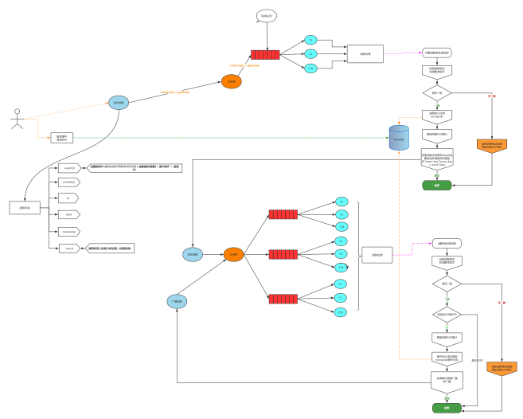

# rabbitmq-event-app
Rabbitmq Event App 是Rabbitmq Event的示例

> 业务频繁的变动，频繁增减活动，导致开发修改现有的业务逻辑，造成程序很混乱，质量无法保证。
也导致测试进行了大量重复而不必要测测试,从而浪费大量的人力成本,而不能有预期到结果。

### 注意
> Rabbitmq Event App 针对大中型企业，高并发业务场景，因为部署简单，你可以快速的安装使用。

## 使用场景 
> 1. 主要务不变，一些像活动、注册、登录、购买送积分、发短信等
> 2. saas平台使用为每个客户部署环境，很多公司用docker 快速部署环境，环境创建后会导入sql，但是可能创建成功事件不确定，我们可以发送一个import_event
事件来解决这个问题
> 3. 不需要实时返回结果

### 案例:

##### 1. 用户注册
> 这个月是送积分，可能下个月送红包

##### 2. 比如活动，每次节假日的活动规则不一样
> 1. 3.8妇女节,女性用户登录（可以获得专属优惠券，购买商品后可以获得额外返现或者双倍积分等规则）
> 2. 5.1劳动节邀请好友(获得实物大礼包,好友购买商品,送2元红包,1.5倍积分，邀请人获得3元红包，10个积分)，购买商品送劳动币。
> 3. 国庆节活动登录、注册、购买商品送爱国币。

### 问题：
> 1. 登录送积分、送红包
> 2. “5.1”劳动节购买商品送劳动币等
> 3. 国庆登录、注册、购买送爱国比

> 在上面这个场景,其实登录、购买、邀请好友这些逻辑是没有变化，每次活动或者需求程序员根据需求不停的修改业务逻辑，每次更改业务，测试都要去做一些重复的测试，那么有没有办法简单化呢。

### 解决：
> 我们使用事件（Event），在注册、登录、购买、邀请好友我们都发送相应的事件（注册register_event、登录login_event、购买product_buy_event、邀请好友inviting_friend_event），我们可以监听在不同的消费者监听同一事件，例如我们登录要送积分，国庆登录又要送爱国比，那么登录登录(login_event)事件同时要送积分和爱国比，我们可以分别写2个消费者去监听登录事件，一个登录送积分消费者，一个国庆消费者送爱国比，当国庆结束我们可以停止国庆消费者。而不必关登录送积分消费者

开发文档
===============================

入门
----
* **已定稿** [关于(Intro)](dev/md/0.0-INTRO.md)
* **已定稿** [安装(Install)](dev/md/1.0-INSTALL.md)
* **已定稿** [安装 Mongodb(Install Mongodb)](dev/md/1.1-INSTALL-MONGODB.md)
* **已定稿** [安装 Rabbitmq(Install Rabbitmq)](dev/md/1.2-INSTALL-RABBITMQ.md)
* **已定稿** [安装 PHP Rabbitmq扩展(Install Rabbitmq)](dev/md/1.3-INSTALL-PHP-RABBITMQ-EXT.md)
* **已定稿** [安装 PHP Mongo 扩展(Install PHP Mongo)](dev/md/1.4-INSTALL-PHP-MONGO-EXT.md)
* **已定稿** -- 分割线 --
* **已定稿** [应用结构(Application)](dev/md/2.0-APPLICATION-STRUCT.md)
* **已定稿** [普通队列配置(Standard Queue Configuration)](dev/md/3.0-STANDARD-QUEUE.md)
* **已定稿** [事件配置(Event Configuration)](dev/md/4.0-EVENT.md)
* **已定稿** [启动网管(Start Gateway)](dev/md/4.5-START-GATEWAY.md)
* **已定稿** [监听队列配置(Listen Queue Configuration)](dev/md/5.0-LISTEN-QUEUE.md)
* **已定稿** [计划任务配置(Cron Configuration)](dev/md/6.0-CRON.md)
